# Luồng Xử lý - System Workflows

## Tổng quan

Tài liệu này mô tả chi tiết các luồng xử lý chính trong hệ thống MoonLight, bao gồm data flow, sequence diagrams và state transitions.

## 1. Luồng Quản lý Sản phẩm

### 1.1 Tạo Sản phẩm Mới

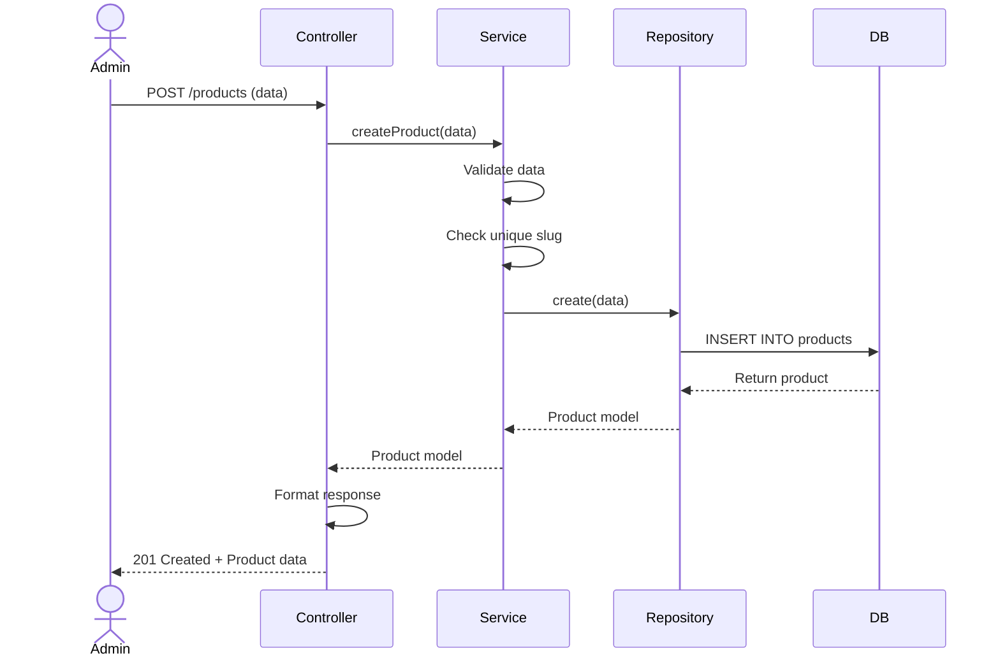

**Chi tiết xử lý**:
1. **Controller nhận request** với dữ liệu: name, slug, description, category_id, status
2. **Service validate dữ liệu**:
   - Slug có unique?
   - Category có tồn tại?
   - Name có rỗng?
3. **Repository lưu vào DB** thông qua Eloquent model
4. **Trả về response** với product mới được tạo

### 1.2 Cập nhật Sản phẩm

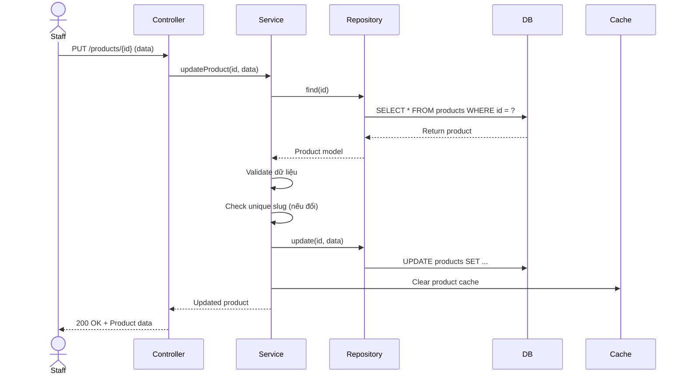

### 1.3 Xóa Sản phẩm (Soft Delete)

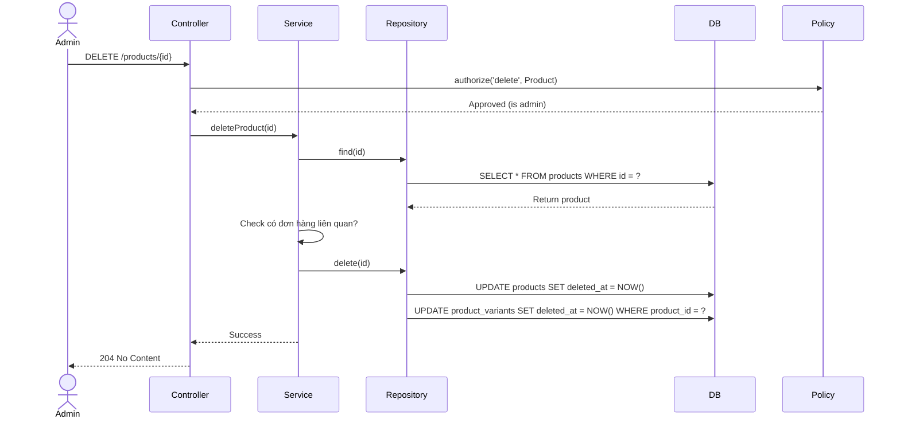

**Lưu ý**:
- Chỉ Admin mới có quyền xóa
- Xóa sản phẩm cũng xóa tất cả variants (cascade soft delete)
- Kiểm tra không có đơn hàng active liên quan

## 2. Luồng Quản lý Biến thể

### 2.1 Tạo Biến thể

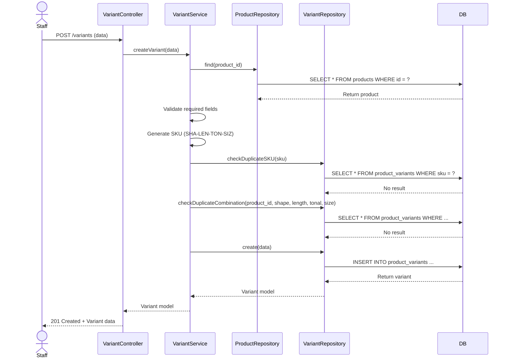

**SKU Generation Logic**:
```php
$shapeCode = substr(strtoupper($shape), 0, 3);       // ROU
$lengthCode = str_replace(['cm', 'mm'], '', $length); // 50C
$tonalCode = substr(strtoupper($tonal), 0, 3);       // WAR
$sizeCode = substr(strtoupper($size), 0, 3);        // MED

$sku = "{$shapeCode}-{$lengthCode}-{$tonalCode}-{$sizeCode}";
// Result: ROU-50C-WAR-MED
```

### 2.2 Cập nhật Kho (Stock)

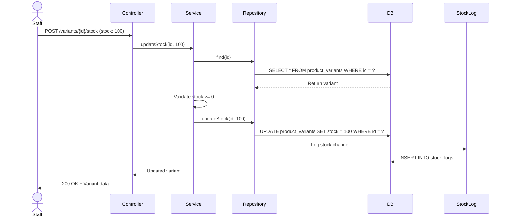

## 3. Luồng Tính toán Giá

### 3.1 Tính giá với Discount

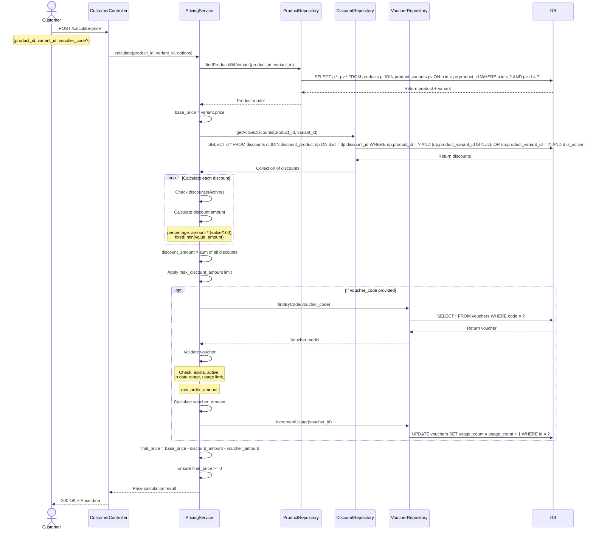

**Price Calculation Algorithm**:
```php
function calculatePrice($basePrice, $discounts, $voucher = null): array
{
    $discountAmount = 0;
    
    // Calculate discounts
    foreach ($discounts as $discount) {
        if ($discount->isActive()) {
            if ($discount->type === 'percentage') {
                $discountAmount += $basePrice * ($discount->value / 100);
            } else {
                $discountAmount += min($discount->value, $basePrice);
            }
        }
    }
    
    // Apply max discount limit
    if (isset($discount->max_discount_amount)) {
        $discountAmount = min($discountAmount, $discount->max_discount_amount);
    }
    
    // Calculate voucher
    $voucherAmount = 0;
    if ($voucher && $voucher->isValid()) {
        if ($voucher->type === 'percentage') {
            $voucherAmount = $basePrice * ($voucher->value / 100);
        } else {
            $voucherAmount = $voucher->value;
        }
        
        // Check min order amount
        if ($basePrice < $voucher->min_order_amount) {
            $voucherAmount = 0;
        }
    }
    
    $finalPrice = max(0, $basePrice - $discountAmount - $voucherAmount);
    
    return [
        'base_price' => $basePrice,
        'discount_amount' => $discountAmount,
        'voucher_amount' => $voucherAmount,
        'final_price' => $finalPrice,
    ];
}
```

## 4. Luồng Quản lý Voucher

### 4.1 Sử dụng Voucher

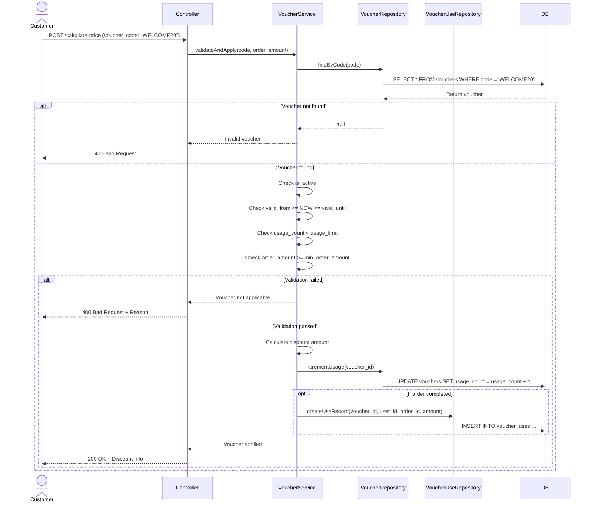

### 4.2 State Diagram - Voucher Lifecycle

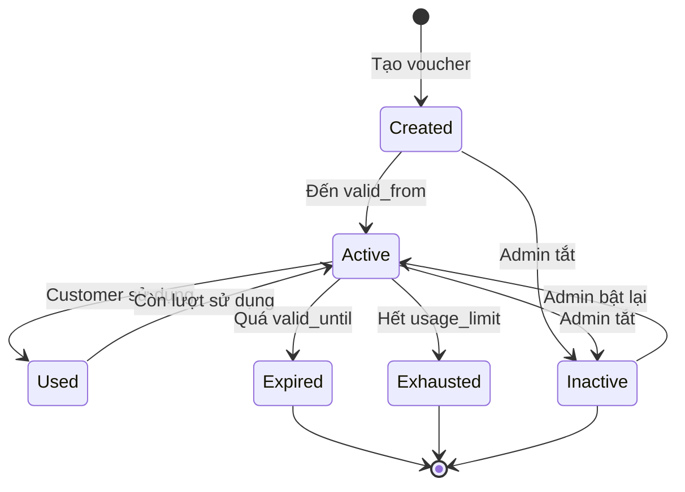

## 5. Luồng Xác thực (Authentication)

### 5.1 Đăng nhập

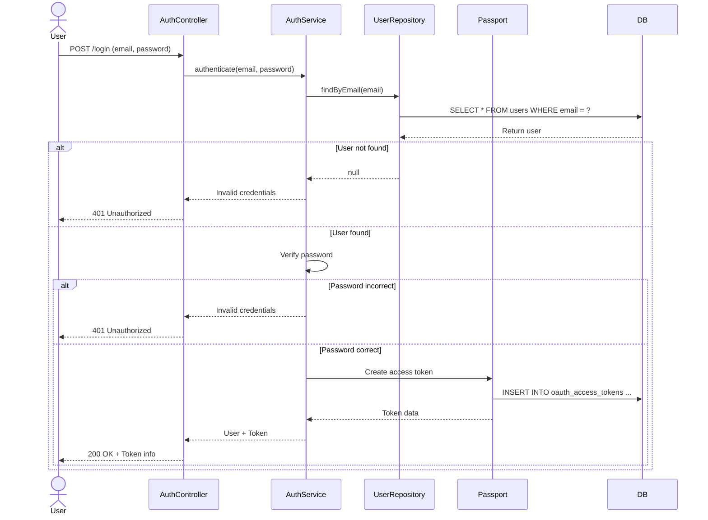

### 5.2 Refresh Token

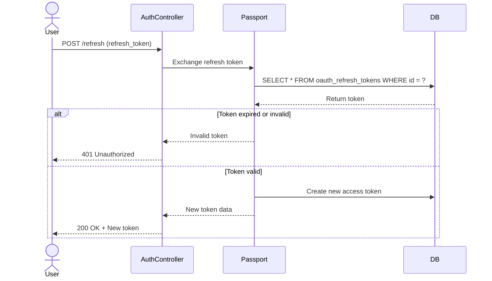

## 6. Luồng Cache Management

### 6.1 Cache Invalidation

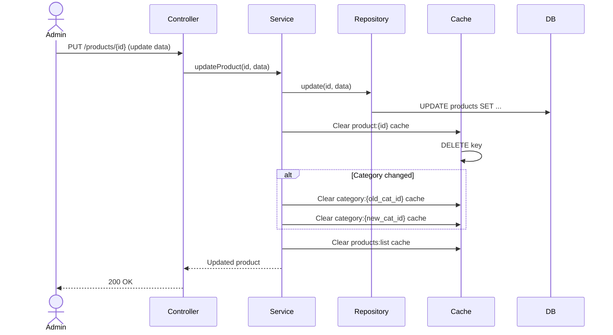

### 6.2 Cache Strategy

```mermaid
flowchart TD
    A[Request] --> B{Cache Hit?}
    B -->|Yes| C[Return Cached Data]
    B -->|No| D[Query Database]
    D --> E[Process Data]
    E --> F[Store in Cache]
    F --> G[Return Data]
    
    H[Data Updated] --> I[Clear Relevant Cache]
    I --> J{Cache Tags}
    J --> K[product:{id}]
    J --> L[category:{id}]
    J --> M[products:list]
```

**Cache TTLs**:
- Product detail: 30 minutes
- Product list: 15 minutes
- Category: 1 hour
- Active discounts: 10 minutes
- User profile: 1 hour

## 7. Error Handling Flow

### 7.1 Validation Error

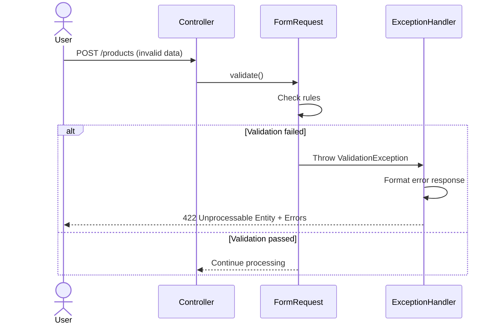

### 7.2 Domain Exception

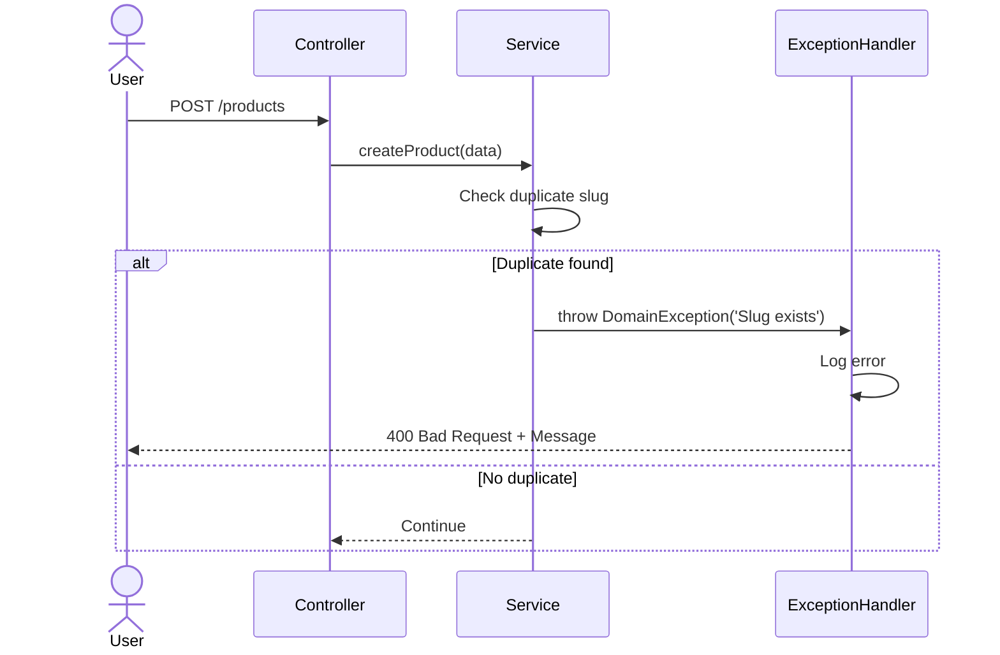

## 8. Batch Operations

### 8.1 Bulk Update Stock

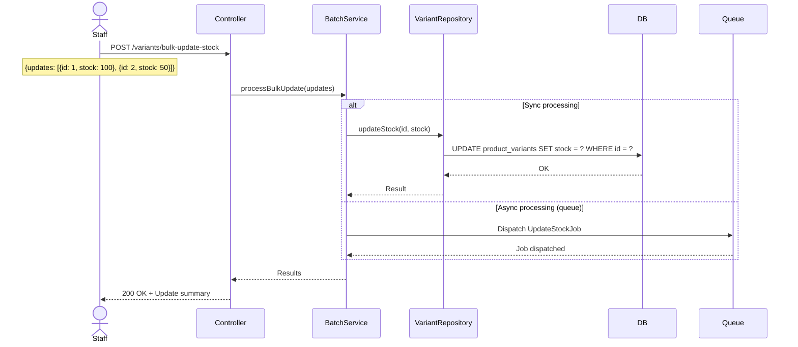

## 9. Event-Driven Workflows

### 9.1 Product Created Event

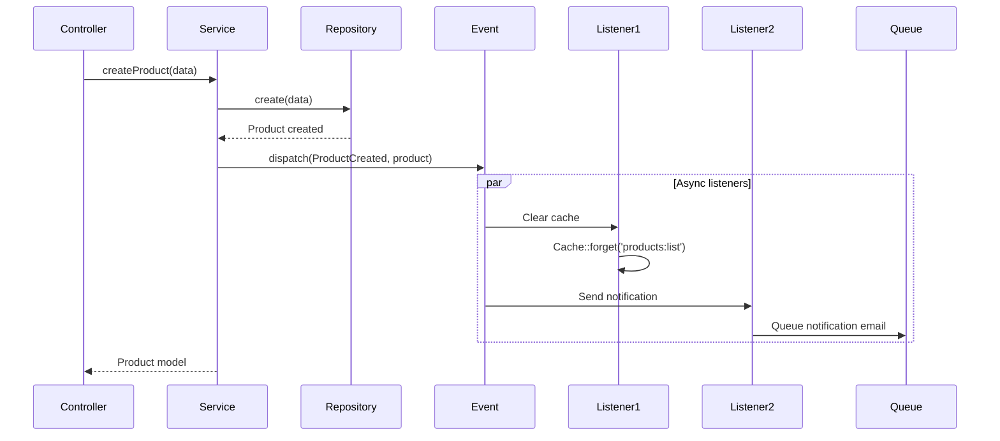

## 10. Import/Export Flow

### 10.1 Export Products

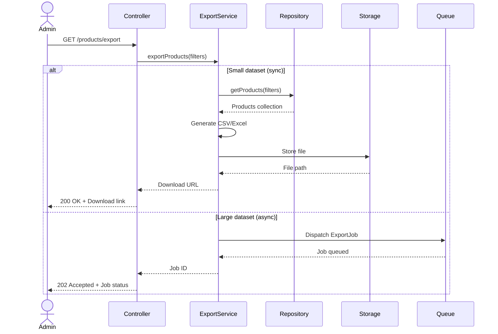

## Event Listeners Reference

| Event | Listeners | Mô tả |
|-------|-----------|-------|
| ProductCreated | ClearProductCache | Xóa cache danh sách |
| ProductUpdated | ClearProductCache, NotifyStaff | Xóa cache, thông báo |
| ProductDeleted | ClearProductCache, ArchiveRelatedData | Xóa cache, lưu trữ |
| DiscountActivated | ClearDiscountCache | Xóa cache discount |
| VoucherUsed | IncrementUsageCount, LogVoucherUse | Tăng count, ghi log |
| StockUpdated | CheckLowStock, NotifyStaff | Kiểm tra kho thấp |

## Caching Strategy

### Cache Keys Pattern
```
products:{id}                    # Product detail
products:list:{filters}          # Product list with filters
categories:{id}                 # Category detail
categories:list                 # Category list
discounts:active                # Active discounts
user:{id}:profile               # User profile
```

### Cache Invalidation Triggers
- Product updated → Clear `products:{id}`, `products:list`
- Category updated → Clear `categories:{id}`, `products:list`
- Discount created/updated → Clear `discounts:active`
- Stock changed → Clear `products:{id}`

## Performance Optimization

### Database Optimization
- **Indexing**: `products.status`, `products.category_id`, `variants.sku`
- **Eager Loading**: Luôn load relationships cần thiết
- **Query Caching**: Cache các query thường xuyên
- **Pagination**: Luôn paginate khi list dữ liệu

### API Optimization
- **Rate Limiting**: 60 requests/phút cho customer, 100 cho admin
- **Response Caching**: Cache GET requests (30s - 5min)
- **Compression**: Gzip response
- **Partial Response**: Cho phép chọn fields cần thiết
